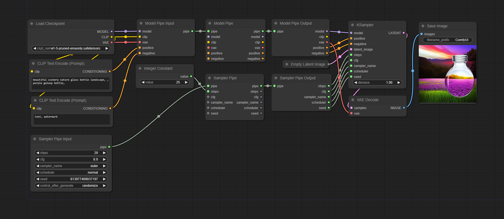

# ComfyUI-EZ-Pipes



ComfyUI-EZ-Pipes is a set of custom pipe nodes for ComfyUI. It provides a set of Input/Edit/Output nodes for each pipe type.

**You can easily add your own pipe types by editing `custom_pipes.py` like so:**
```python
create_pipe_classes("Foo", {
    "model": ("MODEL", ),
    "positive": ("CONDITIONING", ),
    "negative": ("CONDITIONING", ),
    "steps": ("INT", {"default": 20}),
    "cfg": ("FLOAT", {"default": 8.0, "min": 0.0, "max": 100.0}),
})
```

- Input pipe nodes contain editable fields that can be collapsed into input slots.
- Edit pipes contain both input and output slots. Inputs replace pipe contents if provided.
- Output pipes contain only output slots.

Pipes provided by default:
- `SamplerPipe(step, cfg, sampler_name, scheduler, seed)`
- `ModelPipe(model, clip, vae, positive, negative)`

You can collapse pipe nodes and use reroute nodes for convenience.

## Installation

### Using ComfyUI-Manager

ComfyUI-Manager is not provided for now, because the user is supposed to modify the source files, which can interfere with update mechanism of ComfyUI-Manager.

### Manual installation

Follow the steps below to install the ComfyUI-EZ-Pipes Library. These commands assume the your current working directory is the ComfyUI root directory.

1. Clone the repository:
   ```
   git clone https://github.com/romeobuilderotti/ComfyUI-EZ-Pipes custom_nodes/ComfyUI-EZ-Pipes
   ```
2. Edit `custom_pipes.py` to add your own custom pipes.
3. Restart your ComfyUI.
4. Example workflows can be found in `custom_nodes/ComfyUI-EZ-Pipes/examples`.
